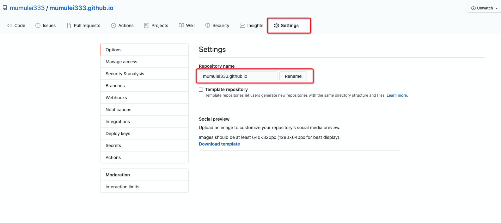
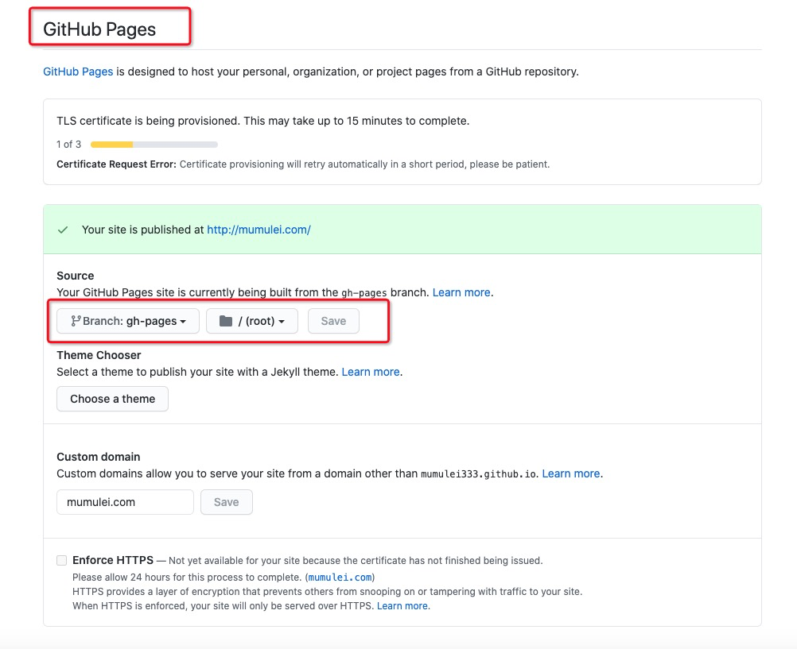
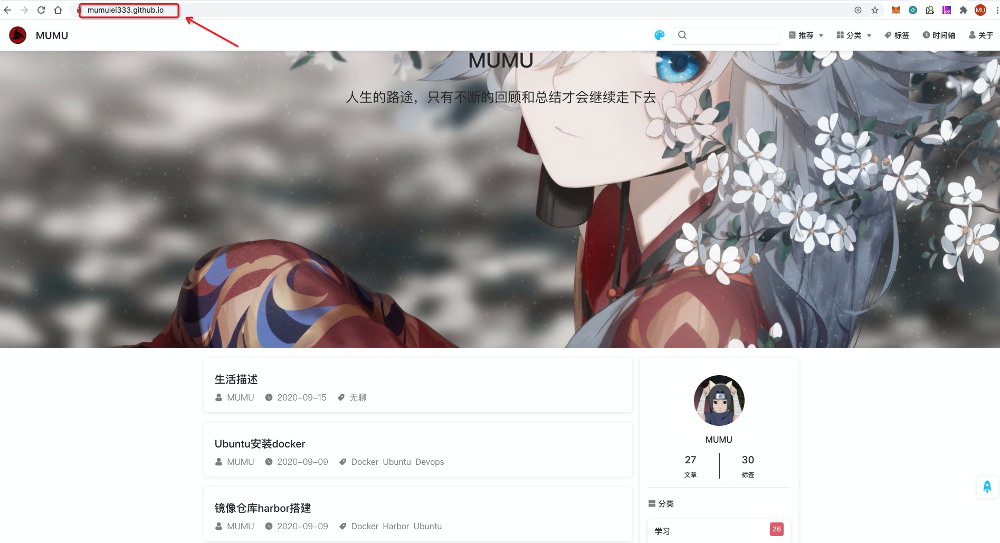
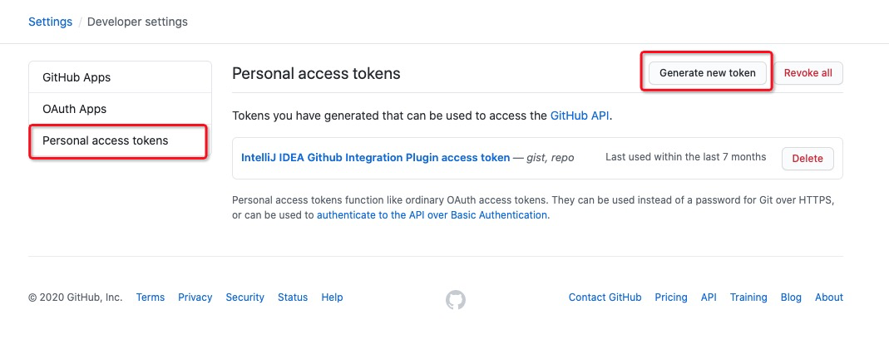
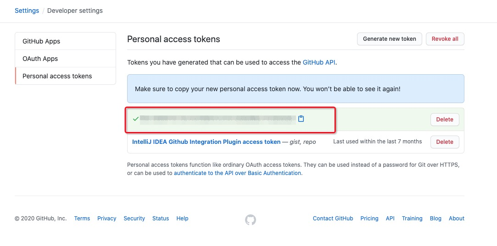

### 获取博客项目模版

这里可以直接Fork我的博客项目当作博客模版[mumulei333](https://github.com/mumulei333/mumulei333.github.io)，如果各位爷今天想中奖那么请给我点个Star吧，我一定会在心中为你祈祷的🙏

### 修改博客项目信息

#### 修改项目名称

将博客项目Fork下来后在项目的主页点击settings，修改项目名称将其改成你github名称的开的.github.io的名称

例如：我的github名称为mumulei333，那么我这个项目的名称则为mumulei333.github.com

#### 修改GitHub Pages默认分支

修改完后往settings页面下面拉到`GitHub Pages`的功能，为他的默认分支源选择为编译后的博客分支

`gh-pages`并保存

#### 验证配置

完成了前面两步你已经完成博客搭建了，现在可以去浏览器上看一下你的博客，域名就是你修改过后的项目`xxxxx.github.io`

怎么样是不是迫不及待的想换上自己的帅气的博客头像还有自己喜欢的妹妹图片墙了🥳，

不用着急去修改gh-pages的分支的编译后的博客文件，下面会更简洁方便的方式告诉你。

### GitHub Actions自动部署博客

##### GitHub Actions优势

因为我们这边使用的是Github Pages方式管理展示博客，使用 `master` 分支管理文章和代码，使用 `gh-pages` 分支存放生成的静态文件

一般部署博客的流程是：

1. 本地配置环境
2. 写一篇文章
3. 生成静态文件：`npm run build`
4. 切换 `gh-pages` 分支
5. 复制静态文件到 `gh-pages` 分支
6. 访问网址验证是否成功

博客就是用来写文章的，每次写篇文章还要搞那么多操作。这里就有很多不乐意了，说“我才没有这么傻呢，我直接写一个构建部署脚本sh不就行了，为什么一定要用GitHub Actions啊”，是的 写一个构建部署脚本的确可以方便很多，但是最重要的是需要在本地配置环境，这个过程的话就比较费事了，如果更换了电脑或者说在不同的电脑上想重新发布的话那么就需要重新配置环境了。

当你使用了 GitHub Actions 之后，流程可以简化为：

1. 写一篇文章
2. 提交到 GitHub

无需配置本地环境，只要能够上的了github就可以随时随地发布最新博客。

##### 配置GitHub Actions

由于我原来项目就已经配置了`.github/workflows/main.yml`所以这边只要是Fork过来的都只需要打开项目的Actions就行了，文件我这边已经配置完了，这里提一句`.github/workflows/main.yml`只能在github上修改，如果是拉下去进行本地修改，是提交不了的。

配置完这个后，可以看到`.github/workflows/main.yml`

`secrets.ACCESS_TOKEN`：部署需要用到项目token

##### 获取ACCESS_TOKEN

点击用户头像 -> settings -> Developer settings -> Personal access tokens -> Generate new token -> 创建token只需要勾选repo权限即可 -> 保存生成的token

##### 配置Secrets

将上一步获取到的部署token保存下来添加到Secrets，`.github/workflows/main.yml`就可以识别到了(变量名不要弄错哦)

这里提一下`.github/workflows/main.yml`中的评论插件需要的`secrets.VALINE_ID`和`secrets.VALINE_KEY`配置方式也是同理，如果有想要详细了解的可以看下这篇[文章](https://mumulei.com/views/blog/github-actions-secret-key.html)

### 部署自己的博客

这里主要讲一下master分支的主要配置以及关键的属性意思

##### 结构

`.vuepress` 目录，所有 VuePress 配置以及都放在这个目录下

`.vuepress/public` 目录，全部的公共静态资源都放在这个目录下，在编译后这个路径的文件会生成在根目录下。

`.vuepress/styles` 目录，用于存放样式相关的文件。

`.vuepress/config.js` 文件，是整个VuePress关键配置文件，全部的配置都在这里配置，因为由于配置太多，导致可读性会大大降低所以这边做了一个引用将部分的配置放在了`.vuepress/config`目录下。

`views` 目录，全部的markdown文档都放在这个目录下，当然你也可以不放在这里，我这边只是方便管理。

##### 属性

在项目根目录下的`README.md`文件中配置了首页图片可以自行更改。

`config.js`文件中的`locales`对象配置主页的中间的博客名称以及首页的装逼语录

`config.js`文件中的`themeConfig`主题风格配置对象，实际目录为`.vuepress/config/theme/themeReco.js`，其中的`logo`属性为配置首页的左上角的博客图片的，`author`属性为作者名称，`authorAvatar`属性为作者头像。

其他的属性描述也可以直接看`config.js`文件，我这边[项目](https://github.com/mumulei333/mumulei333.github.io/blob/master/.vuepress/config.js)里都已经全部都写好了注释。

修改完你想要修改的信息(**本人的博客文章如果你想留的话麻烦标注一下作者及出处 谢谢合作**🤝)后就可以提交到master分支上使用GitHub Actions自动部署了，如果想要看部署情况可以点击到Actions里看部署日志。

##### 借鉴

[VuePress官方文档](https://vuepress.vuejs.org/zh/guide/)

[vuepress-theme-reco主题介绍](https://vuepress-theme-reco.recoluan.com/views/1.x/)

### 自定义域名

这边步购买域名就不再多过描述了，不懂的话可自行百度

##### 配置域名DNS

添加一条CHAME记录，对应映射的就是你的github博客项目地址

##### 配置github Page映射域名

### 博客日常维护

##### 发布博客文章

你可以选择在根目录下`views`的文件中添加自己的文章Markdown，也可以自行重建一个目录都行。

Markdown格式和你原本写好的格式没有什么区别，只是在md文件上方添加一些了参数

`title` : 博客文章标题

`date` : 博客文章发布时间

`author` : 博客文章作者，不填的话默认会使用`config.js`文件中的`author`属性

`isShowComments` : 文章是否显示评论插件以及浏览量

`tags` : 博客文章的标签，用于博客的标签统计

`categories` : 博客文章的类型，用于博客的类型统计

##### 其他

其他的详细属性以及插件使用可以查看vuepress官方文档以及reco主题文档

[vuepress官方文档](https://vuepress.vuejs.org/zh/config/)

[vuepress-theme-reco主题风格文档](https://vuepress-theme-reco.recoluan.com/views/1.x/)

